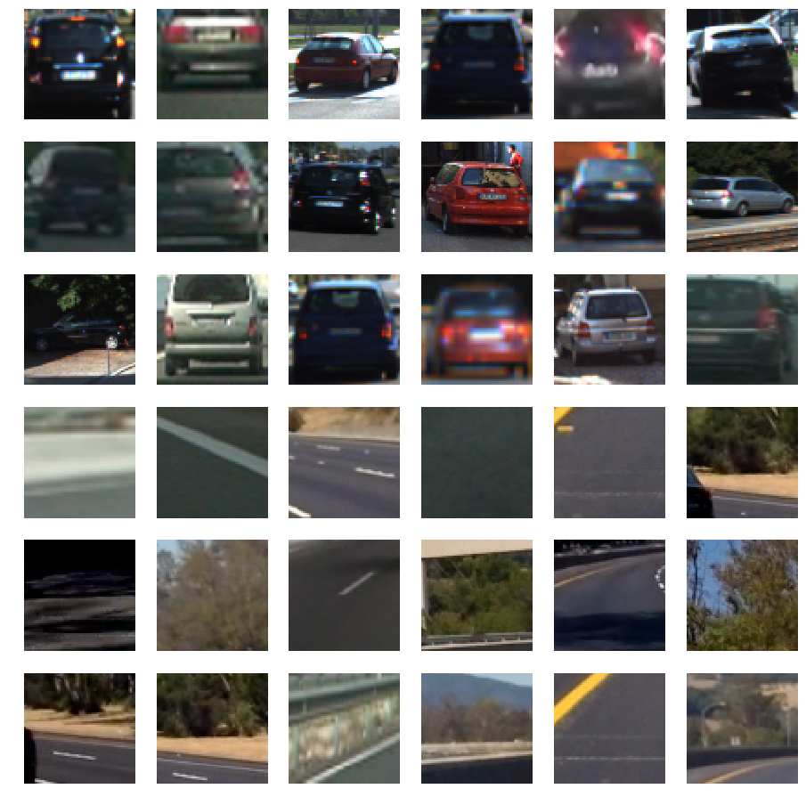
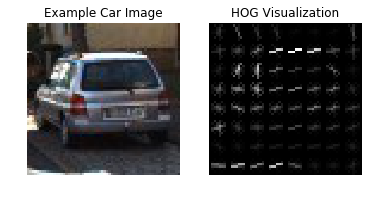
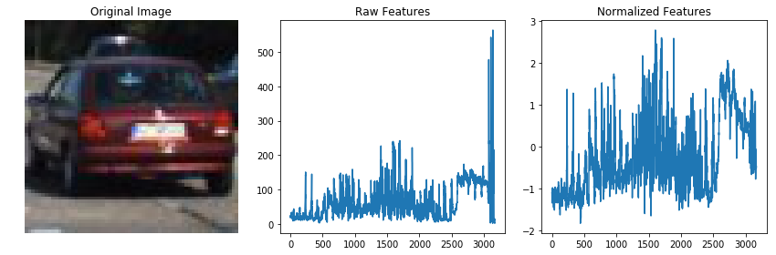
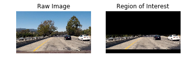
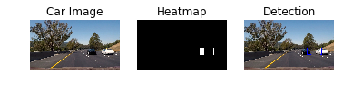
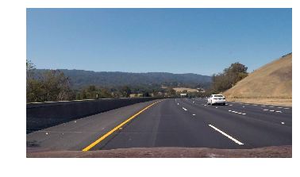
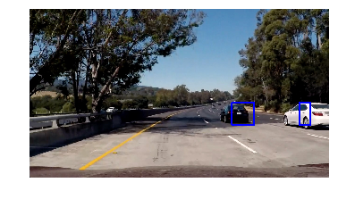
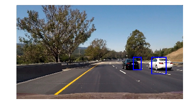

# Project 5 - Vehicle Detection
## 1 Training a Classifier

### 1.1 Download the Data Set
Data sets for [vehicle](https://s3.amazonaws.com/udacity-sdc/Vehicle_Tracking/vehicles.zip) and [non-vehicle](https://s3.amazonaws.com/udacity-sdc/Vehicle_Tracking/non-vehicles.zip) were downloaded to train the classifier with. Below are some examples of images with and without cars and varying ranges of resolution. The more images provided, the better your classifier will be.

 

### 1.2 Extract Features
Images contain many sets of features that can be extracted to help our classifier identify whether there is a vehicle in the image or not. Several methods for feature extraction include abstracting an image into a histogram of colours and a histogram of oriented gradients (HOG). 

 

Parameters such as color space (RGB/HSV/LUV), number of bins, and number of gradient orientations can be fine tuned to further increase the performance of the classifier. Combining multiple methods is ideal however the magnitudes of the features have to be normalized so that one type of feature doesn't overruled another.

 

The parameters that worked best were:

| Parameter | Value |
| ------------- | ------------- |
| Color Space  | YUV  |
| HOG Orientations  | 11  |
| Pixels per Cell | 16 |
| Cell per Block | 2 |
| HOG Channel | 'ALL' |
| Spatial Size | (16, 16) |
| Histogram Bins | 8 |

### 1.3 Label Data Set
With the ability to extract features from images, we need to apply labels to the images inorder to allow the classifier to categorize the images. For this project the labels are simple: '1' for car and '0' for not car. Note: ensure that the relative sizes of the data sets are fairly equal in size to ensure that the classifier will not favour one type of image over the other.

### 1.4 Build the Classifier
The labelled data set was shuffled and 20% of the images extracted to create a training and testing set for evaluating the classifier. From the Python Scikit-Learn I used the LinearSVC to fit the training data for an accuracy of 98.79%. The resulting coefficients for the model were saved using Pickle so the model could be used again at a later time without having to recompile.

## 2 Searching for Vehilces
### 2.1 Sliding Window Approach
Since cars only appear in specific regions of the image we can restrict our search area to reduce the search time on each frame starting at y value of 400 and scanning vertically down to ~650. Since cars will appear to be various sizes in the image depending on their position with respect to the horizon, we need to perform multiple scans at different window sizes to detect cars that are further and nearer.

 

### 2.2 Heat Mapping & False Positives
Since our classifier is not perfect there will always be the scenario where a car is detected where there is no car due to artifacts that appear similar in shape and color. To reduce the occurance of these errors we can use a technique called heat mapping, which takes a mask of all zeros and increases all elements inside the region of the bounding box by one on the detection of a car. Applying a threshold to this new heat map will eliminate any boxes with a value less than the threshold, therefore a region where multiple vehicles were detected will have higher counts (hotter) and regions where false positives occurred will have lower counts (colder).

 

### 2.3 Vehicle Tracking & False Negatives
Sometimes the vehicle is not detected when it is actually present or different regions of the car are detected causing the tracking boundary to jump around between frames. In order to smooth this out and prevent false negatives a Vehicle Detection class was added to track cars on the screen by tracking a moving average of N previous frames. The average of these frames are used to apply the bounding box and track the vehicle even if it is not detected for several frames.

## 3 Pipeline (Image)
Without the Vehicle Detection class implemented, the test images provided by Udacity resulted in the following detection for single frames. 

 
 
 

## 4 Pipeline (Video)
Using the VideoFileClip from MoviePy Editor, the still images from the video clip were extracted and run through the pipeline to generate a new video clip. 

 

## 5 Shortcomings of the Pipeline
Unfortunately, there are several shortcomings to this pipeline. Only one color space was used during feature extraction which limits the amount of information available for the classify to train on. Future revisions should include other color spaces such as RGB, HSV, ...etc. Minimal overlap was used in the window searches so the threshold for the heat map was set low due to too few windows detected per scan, however this was done to speed up the processing time for each video.

 

